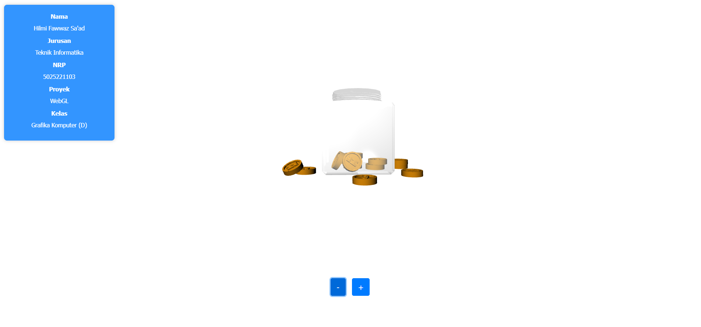

# Tugas WebGL
 Grafika Komputer D

 Hilmi Fawwaz Sa'ad
 
 5025221103

 ## Gambar Blender, Shading Workspace

 ## Gambar WebGL

## Evaluasi
1. Masih adanya perbedaan yang sangat mencolok antara gambar hasil dari Blender dan juga WebGL
2. Tidak semua hasil rendering di blender akan di proses sama dengan webGL, salah satunya dengan render engine EEVEE
3. Perlu memperbanyak eksplorasi, baik dari ide maupun software yang digunakan